# From Noise to Music

Table of contents
-----------------

1.  [Introduction](#_Toc42640287)
2.  [Concept of the project](#_Toc42640288)
    1.  [The storyline](#_Toc42640289)
    2.  [The historical context](#_Toc42640290)
3.  [Development and technological requirements](#_Toc42640291)
4.  [Museological Approach](#_Toc42640292)
5.  [Description of the interaction between the project and the users](#_Toc42640293)
6.  [Pilot production](#_Toc42640294)
    1.  [Modelling the character](#_Toc42640295)
    2.  [Modelling the archive](#_Toc42640296)
    3.  [The animation](#_Toc42640297)
7.  [Further development and maintenance issues](#_Toc42640298)
8.  [Roles in the project](#_Toc42640299)
9.  [Bibliography](#_Toc42640300)

Introduction
------------

The aim of this project is to promote the fiftieth anniversary of Bruno Maderna, which will be the 13th November 2023. Bruno Maderna was a great orchestral composer and musician who founded RAI’s Musical Phonology Studio in Milan, which was one of the most important research centers of contemporary electronic music from 1955 to 1983. Maderna also had a great importance within the Emilia Romagna region, in which there are the Cesena Music Conservatory, the symphonic orchestra of the city of Forlì and the Archive of music in Bologna, which is named after him.

The software Blender was used to make an animation, which had the archive dedicated to Maderna in Bologna as its setting. In addition to the pilot created, we imagined a more complex application, which makes the experience immersive, by a projector, and interactive, through voice recognition. From a software point of view, the idea is to create a web application, which manages the video playback via client and processes the inputs given by the user by voice through Python's SpeechRecognition library via server. Therefore, the necessary hardware includes a projector, a microphone and a computer with an Internet connection. Further details will be provided in the chapter on technological development.

The topics of the project are: the relationship between music and computers in the twentieth century, and the progressive acceptance of noise as music. In fact, pioneers’ masterpieces, such as the ones by Maderna and others, are still considered noise but, nowadays, because of them, composers can use a broader sound palette. Electronic music, videogames’ and movies' themes wouldn't have been possible to make without those pioneers.

Furthermore, the project intends to educate through fun and engagement, in two ways: first of all, the friendliness of the protagonist makes it easier for the audience to get involved, and secondly the use of different pop-culture references for each age group.

This project would be beneficial to both museums and private users. Actually, it was designed for two different museums in Bologna: the MAMbo, the Museum of Modern Art, and the International Museum and Library of Music.

Regarding private users, our project would be appropriate for both a general user of any age, and the music expert. In order to involve the general users, the project creates a communicative connection by using references that are familiar to them. In fact, even though they are surrounded by different genres of music, they may not know their origin, especially when it comes to electronic music. Furthermore, the information is given in a simple way, without any kind of technicalities. Nonetheless, the experienced user can recognize the references because the narration is philologically correct, and nothing is fabricated.

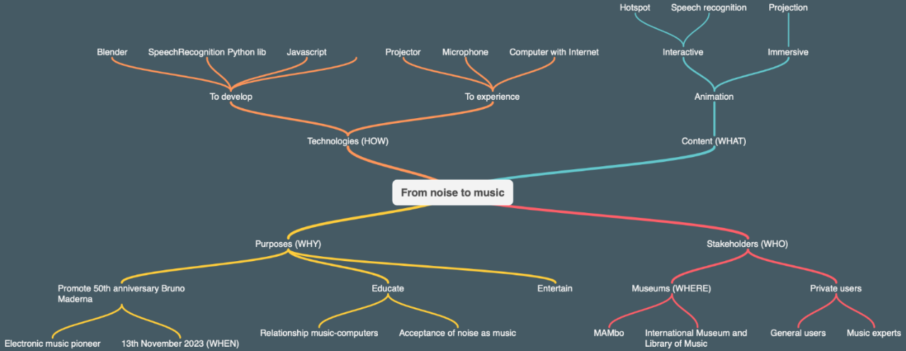

Figure 1 Concept map on the project.

Concept of the project
----------------------

### The storyline

At this point, the storyline of the animation must be outlined. The scene is set in the academic year 2023/2024. Ten students from the Musicology class of the Giovan Battista Martini conservatory in Bologna receive the opportunity to visit the Bruno Maderna Archive, which is part of the "Archives of Music". The visit is scheduled during class hours, in the late afternoon. The purpose of this visit is to write a review on the evolution of music from the second half of the twentieth century onwards.

When the visit ends, the archivist asks the class and their professor to exit, then locks the archive. Nobody realizes that three of the students are missing. The three were fascinated by section M of the archive, and lost track of time. Without realizing it, they are locked inside the archive and their phones do not pick up the signal. Suddenly, he appears: Bruno Maderna, not in human form but as a ghost. After an initial scare, the students learn that Maderna is used to appear once a year, on the anniversary of his death. Suddenly, the phone alarm of one of the three students rings, vibrating, making a series of electric sounds typical of pre-set ringtones of today's smartphones. After hearing the great evolution of noise that has now become standard music, Maderna is moved, and starts talking to the three students. Knowing that the whole class has to write a paper on the evolution of music, he decides to help them by sharing his experience and his ideas. He then starts to tell them about the great influence of many other musicians. These are: Luigi Russolo, Leon Theremy, Edgar Varese, John Cage, Karlheinz Stockhausen, Max Mathews, Frank Zappa, and Laurie Anderson. Without them, music would not be what it is today.

The scene ends with the arrival of the archivist and the other classmates, who rushed to the section M to let the three students out. The three of them want to show the ghost of Maderna to everyone but, in a blink of an eye, the well-known composer is gone.

During his speech, Maderna often refers today’s pop-culture, in order to engage the audience. This technique is explained in David Benyon’s book _Designing Interactive Systems_:

“An interactive application / project should be designed to involve and engage target users, attracting their attention, increasing reflection and self-reflection, stimulating new thoughts. Strategies include: use of personal, familiar or popular elements, unexpected stimuli, provocation, tangible interface, playful dynamics.”[\[1\]](#_ftn1)

Adding popular elements, such as bands and songs that people know, attracts their attention, and increases their ability to make connections, by comparing the facts that they hear with everyday life.

As stated in the introduction, the references were specifically chosen to be relatable to all the different age groups. For instance, in the animation Maderna refers, among many others, an iconic band, Pink Floyd, and two famous artists, Gigi D’Agostino and Avicii. The point of these references is to touch three different generations: Pink Floyd for Generation X, Gigi D’Agostino for Generation Y (also known as Millennials), and finally Avicii for Generation Z.

### The historical context

In this chapter, we intend to offer a historical overview of the characters and themes of the project. This dissertation can only start from the protagonist of our story.

Bruno Maderna was born in 1920 in Venice, and he was son of an artist: his father was a musician, and when Bruno was seven, he had him perform as a violinist and conductor in his orchestra. He was, therefore, a child prodigy. During the Second World War, he joined the partisan resistance and was later captured and imprisoned by the Nazis[\[2\]](#_ftn2).

After the war he began to study dodecaphonic music, a technique of musical composition conceived by Arnold Schönberg in 1923, that has the search for dissonance as its focus, in contrast with the harmonies of the Romantic period.

The RAI Phonology Studio in Milan, founded by Maderna and Berio in 1955, was one of the most authoritative centres of experimentation of contemporary electronic music. John Cage was also involved in some of its productions. For example, the song_Musica su due dimensioni_(1952) was the first-ever to foresee the interaction between a live musician and a recorded tape. It was a piece that still connected past and present, traditional music with electronic music.

Instead, _Sequenze e strutture_(1954),_Notturno_(1955) and_Syntaxis_(1957) brought a clear break. These were pieces made not only of different sounds but of different compositional and perceptive processes.

In 1971 Bruno Maderna took over the direction of the RAI Symphony Orchestra.

His eclecticism made him famous all over the world and he became an international author. In Darmstadt, Germany, for instance, Maderna came into contact with many authors who then would play an essential role in the evolution of 20th-century music, such as John Cage and Karlheinz Stockhausen. Darmstadt became the chief seat of his life: he received its official citizenship in 1970 and it was also the place of his death. He died of lung cancer in 1973 at the age of 53.

The first artist Maderna will tell the kids and the public about is Luigi Russolo. He was a futurist and he considered the noises of a city as music because they transmitted the idea of speed, strength, power and future. On that topic, he wrote_The art of noise_in 1913 and composed_Risveglio di una città_in the same year. He also created the first mechanical orchestra in history, the so‑called_Intonarumoris_, made by percussions with names such as howlers, explorers, crumplers or scrapers[\[3\]](#_ftn3).

The story continues with Leon Theremin. In 1919, he invented the first electronic music instrument: the Theremin. This instrument is controlled without any actual physical contact. The instrument's controlling section usually consists of two metal antennas that sense the relative position of the performer's hands and control oscillators, frequency with one hand and amplitude (volume) with the other. The electric signals from the Theremin are amplified and sent to a loudspeaker.

Theremin's story is sorrowful. He was a professor at St Petersburg, in Russia, talented in Physics and Cello, but he was imprisoned by KGB during the Second World War and forced to produce bugging devices for fifty years. At last, he was freed, and the world still remembers his final concert in the USA at 95 years old.

In addition, he was crucial because he inspired the work of Edgar Varese and Alfred Hitchcock. Not by chance, nowadays the Theremin's sounds are typical in horror movies.

The Frenchman Edgar Varese strongly disagreed with the Italian futurists, because he did not want to limit himself to reproducing the sounds of everyday life. Instead, he wanted to create new ones, to "free the spirit of sound", to use his own words[\[4\]](#_ftn4).

For this reason, he emigrated to the United States, to New York, the most modern city in the world. There, in 1931, he composed_Ionization_, the first concert in the world performed by percussions only, and_Poeme Electronique_in 1958, in which slides created by Le Corbusier were accompanied by synthetic sounds.

Influenced by Schonberg, Varese and Duchamp, John Cage wanted to overcome the concept of musical taste and accept every type of sound as music. In 1952 he performed his famous_4'33''_of silence, in which the audience was playing, with its coughing, the embarrassment and contempt for the novelty of the work, showing that silence does not exist.

In 1960 he went even further by embracing the sound of a moving cartridge in his_Cartridge music_.

The story continues with Karlheinz Stockhausen. His masterpiece is_Gesang der Junglinge_, the children's song, of 1956, in which Stockhausen combined synthetic sounds with children's voices. The big novelty was in the electronic manipulation of analogue sounds, which revealed the potential inherent in duplicating, cutting and joining sounds. At the time, there were no digital instruments and a similar operation, which is trivial nowadays, was extremely complicated.

The_Gesang der Junglinge_was projected into a performance hall with strategically located speakers to give the audience an immersive audio experience.

In 1963, while working at Bell Laboratories, Max Mathews wrote an article in which he predicted that the computer would become the musical instrument of the future. Twenty years later his words became reality. In this regard, he invented the first complete interactive computer music system, the_Groove_, in 1969, which was used to control the_Moog synthesizer_, developed five years earlier by Robert Moog. It is the precursor of MIDI. Before him, electronic compositions were made using extremely complicated punch-card systems.

During his lifetime he also collaborated with John Cage.

Frank Zappa was a famous rock musician, composer and iconoclast. Varese, Webern and Stravinsky profoundly influenced him. After a lifetime of concerts, in the 80s, he chose isolation and devoted himself to the composition of electronic music using the Sinclavier through the already named Groove program. In this way, in 1986 he produced the album _Jazz from hell_, perhaps the most experimental of his life.

The story told by Maderna ends with the extraordinary figure of Laurie Anderson. "Newsweek" magazine described her well on February 21, 1983, by saying: "Anderson is like an electronic Cassandra, a prophetess, a sibyl, feeding us words, images, sounds, melodies, gags, dreams and stories". Undoubtedly influenced by John Cage's indeterminacy, she aimed to merge with the machine in music production. Her style is characterized by the use of an androgynous voice processing, as well as pulsating dance rhythms and hypnotic images, a real example of_Gesamtkunstwerk_, of Total Artwork in the postmodern era. Her song_O Superman_, from the 1983 4-part performance_United States,_has remained well known.

Development and technological requirements
------------------------------------------

For this dissertation, we focused on the development of a prototype, that is about three and a half minutes of animation which sees Bruno Maderna as the only character, and the archive dedicated to him as the only environment. It is clear, however, that the intention is to develop a much more complete and complex product, the specifications of which we intend to present in this chapter.

As for the duration, the final animation is expected to be about twenty minutes. It seems a reasonable time to offer a meaningful experience without boring the public or, worse, slowing down the flow inside the museum. The point of reference, in this case, was the 3D cartoon created by Cineca for Genus Bononiae, which saw the character of Apa at the centre discovering the origins of Bologna. Its duration was precisely about twenty minutes. In the same way, our animation will retrace the fundamental stages of the relationship between music, computers and noise in the twentieth century. Even if Maderna is the protagonist and narrator, since the project is dedicated to the fiftieth anniversary of his death, it will be necessary to develop many other characters and settings. First of all, it will be fundamental to model the boys of the Musicology class of the Bologna Conservatory and their teacher, as well as the archivist of the Maderna Archive. In addition to them, who only have a narrative function, it will also be essential to recreate the eight geniuses and pioneers of the music that Maderna himself will introduce in his narration. As mentioned in the previous chapter, they are Luigi Russolo, Leon Theremin, Edgar Varese, John Cage, Karlheinz Stockhausen, Max Mathews, Frank Zappa and Laurie Anderson. A short animation will be dedicated to each of them in different contexts, always united by the common thread of Maderna telling their stories.

One might wonder why we considered developing animations, an expensive task, rather than merely using videos for the various characters mentioned above. The reason has to do with possible copyright problems: by recreating the various events and settings from reality, copyright claims would be easier to avoid. In particular, reference is made to Article 70 - Law 633/1941 on copyright, which says:

"Free publication through the Internet is allowed, free of charge, of low-resolution images and music or degraded, for educational or scientific use and only if such use is not for profit."[\[5\]](#_ftn5)

Needless to say, the works of all the authors considered are covered by copyright, which according to article 148 of the same law mentioned above lasts "for the life of the author and for seventy years after his death".

Therefore, for purely academic purposes, such as those of this dissertation, it was legitimate, for example, to use videos from the Pink Floyd concert in Knebworth in 1990 or from the performance of Maderna's Musica su due dimensioni in Milan in 2011, both found on YouTube. However, if this prototype were to turn into a real project for a real museum and therefore to be financed, it would no longer be possible to use them, or it would be necessary to obtain licenses for them. Therefore, to avoid this kind of problems, we decided to animate everything or at least everything that is not strictly indispensable to show via video.

Another aspect of development concerns the product’s dissemination. Three possible applications were imagined, to make the installation as flexible as possible for the destination museum: through a screen, a projection or a VR headset. Each of them has advantages and disadvantages. The screen is cheap, takes up little space but is not immersive. On the other hand, the headset is extraordinarily immersive but more expensive, because one must be bought for each user, while several people can watch a screen at the same time. Besides, the VR is not usable by everyone, given the known motion sickness problems it causes. Therefore, it is less accessible. The projection has a median cost between the two solutions mentioned above, just as the level of immersion is intermediate. Its disadvantage is that it requires much space inside the museum, if not a separate dedicated room. However, for the reasons mentioned, the projection still seems the best compromise.

Once a sufficient level of immersion is guaranteed, another aspect to take care of in creating a modern and engaging product is surely interactivity. Even though the 3D cartoon created by Cineca for Genus Bononiae excelled in immersion, the experience was still that of a seated and passive spectator. For this reason, we introduced a certain degree of interaction between the user and the projection. It occurs on two levels: a passive one and an active one. The first level of interaction concerns the activation of the screening, which happens when the user approaches a specific hotspot. A second level regards the possibility to choose how much to watch, if all twenty minutes of animation or only certain portions, which correspond with certain composers. After the introduction, Maderna asks the students in the animation, and also the spectators, if they have the time and the interest to listen to the whole story or if they are in a hurry and want to hear, for example, only the story related to Laurie Anderson, skipping the others.

From a technological point of view, the first level of passive interaction is obtained using a motion sensor. The second level, on the other hand, can be achieved in various ways, with different degrees of natural interaction. Following the scale illustrated by Carrozzino and Bergamasco in the article_Beyond virtual museums: Experiencing immersive virtual reality in real museums_[_**\[6\]**_](#_ftn6), we can notice that the fewer sensors are used, the more natural the interaction is.

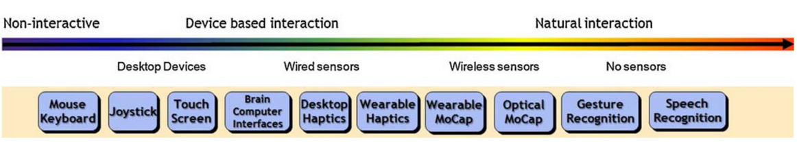

Figure 2 Classification of devices on the interaxion axis.

For example, if we use a projector with touchscreen technology, a pointer is needed in oder to interact. At a much higher level, we find solutions such as the Xbox Kinect, which allows interaction through mid-air gestures. But the most natural interaction is achieved by using voice recognition. The latter solution also appears to be the most economical, because the first requires the purchase of specific projectors and the second needs a console and a sensor, while a standard microphone is enough to obtain the input voice.

From a software point of view, numerous libraries and APIs deal with voice recognition. Among the many, we want to mention _SpeechRecognition_[\[7\]](#_ftn7), a Python library that uses various APIs, such as Google Speech Recognition, Google Cloud Speech API and Microsoft Bing Voice Recognition. Through the use of artificial intelligence and the computational power of Google and Microsoft servers, the level and effectiveness of recognition are very high. Moreover, there is support for the Italian language. The only limitation of this solution is that, in order to take advantage of the Google and Microsoft APIs, the computer used for playback must have an Internet connection. A viable way would be to create a web application, which uses _SpeechRecognition_ on the server-side. At the same time, on the client-side, it controls the animation through Javascript and the HTML5 <video> element.

To sum up, for the development we intend to use Blender to model in 3D and create the animation, the Python_SpeechRecognition_library for speech recognition and Javascript for playback control. From a hardware point of view, to make the experience possible, the museum should only make available a computer with an Internet connection, a projector and a microphone.

Museological Approach
---------------------

The purposes of our project adapt perfectly to the goals of a museum in general: to educate and entertain. ICOM has defined the museum as "a non-profit, permanent institution in the service of society and its development, open to the public, which acquires, conserves, researches, communicates and exhibits the tangible and intangible heritage of humanity and its environment for the purposes of education, study and enjoyment"[\[8\]](#_ftn8).

In addition to adapting to the standards defined for tangible museums, however, our project makes extensive use of digital technologies and then falls within the definition of the virtual museum[\[9\]](#_ftn9).

It is, therefore, necessary to define what type of virtual museum we intend to develop and what its classification may be. For this purpose, reference is made to the_Taxonomy for virtual museums for the use of AVICOMM professionals_as defined by Simona Caraceni in 2015. Among the six categories identified by her, in this case, the most appropriate is the C, which is the one that responds to the museum's need to improve the exhibition. The table below shows its essential characteristics.

NEED

Exhibition

CATEGORY

Interactive projection inside a museum gallery

TECHNOLOGY

Projection, voice recognition

CONTENT

Digital movie

VIRTUAL/REAL

Virtual with virtual

VISITORS EXPERIENCE

Active watching film

Thus, it is not a matter of creating a new virtual museum, but of inserting in existing museums to enhance their exhibition. As mentioned, the prototype was developed with two Bologna’s museums in mind: the Museum of Modern Art (MAMbo) and the International Museum and Library of Music. Both of their offers would be expanded while remaining consistent with their current spirit. In fact, the first museum deals with Contemporary Art, and electronic music certainly falls within this area; the second one deals with the history of music but its offer stops at the nineteenth century and would, therefore, extend its proposal to the twentieth century.

The city of Bologna, in general, seemed appropriate also by reflecting on the value of the so called _genius loci_, as described by Alessandra Mottola Molfino in the article_Musei del “genius loci”: il modello italiano_, in which a close connection between the museum space and the territory is encouraged:

“Nell’epoca della cultura planetaria non è più necessario raccogliere nei pochi centri del sapere delle città capitali grandi biblioteche e grandi musei enciclopedici, questo compito è infatti svolto dalle reti di informazione telematica che portano ‘a domicilio’ tutte le conoscenze mondiali. Diventa invece indispensabile riconoscere (e approfondire) la diversità e la specificità culturale dei singoli paesi, e delle anche minime storie culturali: presentare cioè nei luoghi, nei contesti, nei paesaggi dove sono nati, i beni culturali che ad essi appartengono.”[\[10\]](#_ftn10)

As mentioned in the introduction, Bruno Maderna is a very dear person to Bologna and Emilia‑Romagna in general, so much so that in Bologna there are the Maderna Study Center of the Department of Arts and the Bruno Maderna Archive. At the same time, Cesena’s conservatory is dedicated to him, as is Forlì’s symphony orchestra.

Continuing in the reading of the table, we saw in the chapter on technological development how the activity is not that of a passive spectator, but of an engaged visitor who can choose what to watch. Therefore, we enhanced the experience of the 3D cartoon created by Cineca for Genus Bononiae which, although immersive, did not hit the mark in terms of interactivity. The related table is provided, taken from page 246 of the paper mentioned above,_Designing a taxonomy for virtual museums_by Caraceni S.

NEED

Exhibition

CATEGORY

Projection inside a museum gallery

TECHNOLOGY

3D projection

CONTENT

Digital 3D movies, dolby surround sound

VIRTUAL/REAL

Virtual with virtual

VISITORS EXPERIENCE

Passive watching film, sitting

Quoting Caraceni:

“The Genus Bononiae 3D theatre is a very ‘old­fashioned’ conception of a virtual museum, consisting in a 3D cinema, for passive consumption”.

However, we should not forget that Cineca's production won the award for the best short feature in the audiovisual section of the International Audiovisual Festival in Museums and Cultural Heritage

FIAMP of AVICOM in 2012, won at Siggraph Asia 2011 in Hong Kong, in the Multimedia section Posters, and was ranked in first place at the event eContentAward Italy 2011 as the best product in the category Italian eCulture and Heritage. On the same occasion, it also received a special mention for the eLearning and Education section.

Therefore, it remains an absolute point of reference for all animations for museums that have the purpose of educating and entertaining. For this reason, some of its features not considered in this project will be taken into consideration in the chapter on possible future developments.

The choice to make the experience customizable by the user, giving him the possibility to choose whether to watch the whole animation or only a part, responds to Serrel’s categorization of the various types of visitors inside a museum. He divided them into three types: “the transient, the sampler and the methodical viewers”[\[11\]](#_ftn11). In other words, some visitors rush, some select what to watch and some study everything. An experience like that developed by Cineca is hugely satisfying for the second and third types, but it could be frustrating for a visitor who runs.

This discourse is part of a more general evolution of communication theory. It went from the hypodermic theory - which considered the mass media as authoritative, persuasive tools acting on a passive and inert mass - to the agenda-setting, which instead sees viewers as influential figures who choose what to look[\[12\]](#_ftn12). Then, we went from the passivity of the public to the research of their tastes and the most palatable ways to convey a message. It is no longer enough to propose contents, but we have to adapt to our target. That is why we decided to personalize the experience and make it interactive.

Description of the interaction between the project and the users
----------------------------------------------------------------

In order to describe the interaction between the project and the user, we have chosen to use UML, the Unified Modeling Language, a general-purpose, modelling language to visualize the design of a system.[\[13\]](#_ftn13)

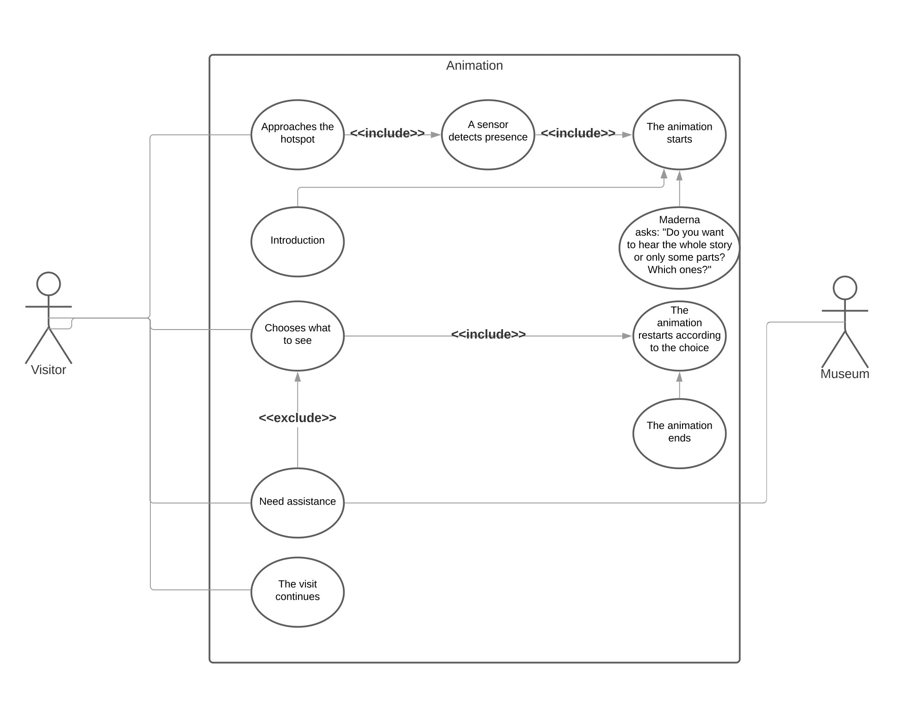

Figure 3 UML representation of the interaction between the system and the user.

The graph consists of four main elements: the system, represented by the central rectangle, which, in this case, is our animation. The primary actor, who initiates the use of the system, i.e. the museum visitor and the secondary actor, who reacts to user actions, i.e. the museum itself, represented respectively by the stickmen to the left and right of the system. Another central element is the use case, that is the actions performed relating to the system, represented by the ovals within the system. Finally, there are the relationships between the actors and the use cases, represented by the lines. The lines can be of three types: association, or actors acting; inclusion, or necessary implications of the first actions; exclusion, or unnecessary implications, and generalization, or hierarchies between activities.

Going into the detail of our chart, we can see how the action begins because of the visitor's approach near the projection. A sensor detects its presence and, if the animation is not already in progress, starts it. The introduction starts: the public sees the opening scene with the boys in the archive, the appearance of Maderna and the first speech. Then, the user is allowed to choose whether to watch all twenty minutes of animation or select the composers that interest him most. The user decides, and the animation continues following the selection. It's the only moment in which there is an active interaction between the visitor and the projection; therefore, it is the single occasion in which the user may need assistance. It is the reason why we used the "exclude" label in this step. Note also that for the entire duration of the process there is no need for mediations by museum staff because the whole system is automatic. If the user does not need help, the museum never intervenes at all. Finally, the animation comes to an end, and the visitor can continue his visit.

Pilot production
----------------

As a pilot production, we chose to create an animation of about three minutes. Regarding the time of the story, it takes place after the three boys have been locked up in the archive and after the apparition of Maderna, when the composer introduces the speech that will lead him to talk about the evolution of noise as music in the twentieth century. We can, therefore, consider this passage as the actual entry of the character on the scene, who at this stage is the only one to speak and act. It should be noted that we chose to make him speak Italian, for various reasons: first of all, because the artist is Italian and, although he knew English and German as well, the public will be that of two Bolognese museums. The most appropriate language is, therefore, Italian. The script is shown below:

**Bruno Maderna**: …Dovete sapere che alcuni suoni che per voi è normale sentire alla radio e che magari non vi trasmettono più alcuna emozione, nei miei centrali anni di vita erano rumori rivoluzionari. Già, il ventesimo secolo è stato zeppo di scandali e scalpore, dei quali, modestamente – _he puts his hand to his mouth as he says it_ \- sono stato spesso protagonista.

Pensate che una volta, al posto di organizzare uno spartito, decisi di spiegare all’orchestra la sequenza attraverso onomatopee che facevano.

_The camera zooms in on a video, showing the real Maderna as he makes bizarre sounds_.

_Maderna laughs_.

Eppure, nonostante molti mi ritengano tutt’oggi un folle, eccomi qua cinquant’anni dopo, in un luogo che hanno dedicato proprio a me.

_Archive overview_.

_Maderna puts his foot on a chair and spreads his arms._

Qui siamo nella sezione M, quella dei miei manoscritti, abbozzi, particelle e così via. Di sezioni ce ne sono addirittura tredici: ci sono cassette, foto, partiture... Ad ogni anniversario della mia scomparsa mi piace tornare e osservare il mondo che va avanti e la mia amata musica che si evolve.

È stato davvero un peccato ricomparire un anno dopo la mia morte, nel 1974, e sentire _Shine On You Crazy Diamond_ dei Pink Floyd senza poter mostrare al mondo la mia commozione.

_The camera zooms into Maderna's eye. Transition on a Pink Floyd video. There are transitions to other videos that illustrate what is being said._

Vedete, il celebre gruppo mise in pratica il modo di fare musica che ideai io: unire dei suoni di strumenti musicali a dei suoni sintetici. Voi penserete “e che c’è di così innovativo? Lo fanno Gigi D’Agostino, Avicii e molti altri”. Be’, ai miei tempi non era poi un’idea così “pop”. Fui io il primo a sperimentarla, e di certo non potevo aspettarmi il successo che ebbe, o l’incredibile numero di artisti che l’avrebbero fatta propria. Certo, io non la suonavo a Ibiza o al Coachella, ma neanche nel mio scantinato. In caso non lo sapeste, sono stato proprio io a fondare lo Studio di Fonologia della Rai a Milano che, a mio modesto parere, è stato uno dei centri della sperimentazione di musica elettronica più “cool”.

_Zoom out on Maderna's face._

Sì ragazzi parlo come un giovane, sono sempre stato avanti.

_Maderna winks_.

Attraverso gli scarabocchi in questi libri - _Maderna points to the shelves_ - c’è tutta l’evoluzione del rumore che ad oggi è diventato musica. È proprio qui, in questa vecchia stanza impolverata, che si parla di voi e tra 20 anni si parlerà dei vostri figli: tra le righe sparpagliate di questi spartiti strampalati.

_Maderna points to a table in front of him, the camera zooms in on the tabletop, framing it from above: you can see one of his scores._

Le note su cui ballate altro non sono che il progresso della mia ispirazione. Be’, non solo della mia, anche di quella di altri. Ma è della mia che ci importa adesso.

_Maderna laughs_.

Sarebbe proprio un privilegio poter visitare questo archivio con me, l’uomo a cui è intitolata ma ecco… un artista del mio calibro è sempre molto impegnato. Certo, in effetti è da un po’ che non vedo anima viva… sto qui, sperimento, teorizzo, faccio cadere qualche libro dagli scaffali per spaventare l’archivista… Va be’ dai, forse per voi posso fare un’eccezione. Mi siete simpatici e diciamocelo: in realtà mi annoio parecchio.

Ho sentito che dovete presentare una ricerca su tutta questa roba, per cui vi farò un gran riassunto, così ne saprete una in più del diavol - ehm... volevo dire, della vostra professoressa. E ricordate: la musica si ascolta e si condivide, altrimenti resterebbe per sempre un rumore.

In the following chapters, we will go into the details of how the character and the surrounding environment were modelled and how the animation was created.

### Modelling the character

#### The mesh

As for the modelling of the protagonist, Bruno Maderna, the focus was to create a friendly and cartoonish character. Although it is a ghost, the purpose is not to scare, but to educate and entertain. For this reason, he has been given the appearance of a living human being, without any hint to his ghostly nature. Finally, he was made to look as similar as possible to Bruno Maderna.

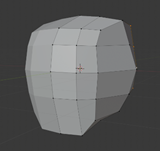

Figure 4 First face model.

The reference software for this project was Blender. In order to explain the complexity of this work, its fundamental steps must be retraced. Since in Blender most of the meshes originate from a cube, by using the mirror modifier and proportional editing, the cube was first divided and then block out to give it the shape of a face. Special care was put in keeping all faces quadrangular and proportional, because triangles become terribly deformed when the character is animated.

Using the inset tool, space was then obtained for the eye cavities, which were further modelled using the loop cut and extrude tools. A similar thing was done for the eyebrows, nose and mouth. Interestingly enough, the basic position of the mouth was that of a smile, which gave much more affability to the character. The eyeballs were made using solely two UV spheres.

The rest of the body, starting from the neck, was made simply by extruding the lower sides of the head, after removing the corresponding faces. Likewise, the arms and legs were extruded from the torso, the feet from the legs and the ears from the head. To ensure proper deformation of the elbows and knees, two loop cuts were added around the corresponding edge loops and they were given a slight angle to make the posture more natural. The same was done later for all joints.

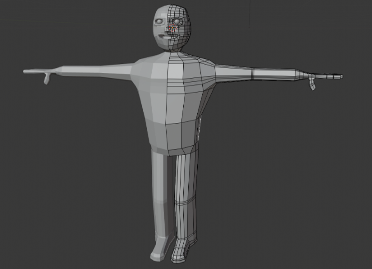

Figure 5 First body model.

The hands, the teeth and the tongue were instead carved starting from a cube, subsequently joined to the rest of the body.

To give the impression that the character is wearing clothes, these were simply modelled on him. In particular, the concept included a polo shirt, jeans and leather shoes. A simple, casual and always current look. Numerous photos document Maderna's style, which seemed particularly suitable also to bring the protagonist closer to the public.

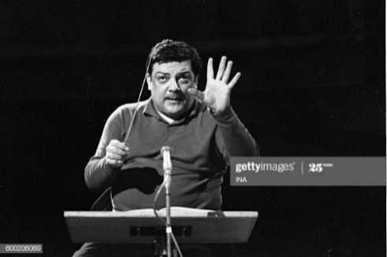

Figure 6 Bruno Maderna manages the orchestra of the musical domain to the Theater 104 of the Maison de la Radio.

The most delicate aspect in modelling a human character is perhaps the hair, given the complexity involved in animating it. To simplify, they were then made using a single mesh, that is a UV sphere, which was halved in a hemicycle and then sculpted with proportional editing to give it a shape as similar as possible to Maderna's typical hairstyle. The solidify modifier was added to increase the thickness of the hair.

In conclusion, the shade smooth function and the subdivision surface modifier were used to make everything less edgy.

Figure 7 Final body model.

#### The armature and the rigs

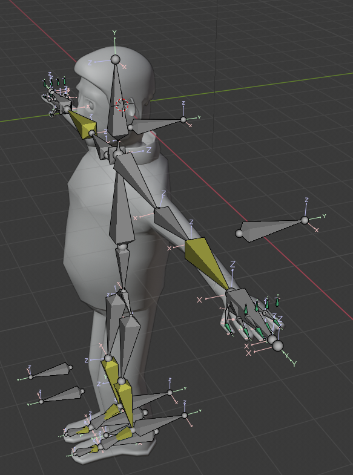

Figure 8 The armature and the rigs.

Modelling a mesh is not enough to animate it, but an armature must be made. In addition, the operation was entirely manual, which consisted in adding all the joints bone to bone. In the case of our project, the bones of the chest, hips, legs and feet were essential to allow the character to walk, as it was a general controller for the whole body, so that its position could be changed. In addition, the bones of the shoulders, arms, hands and fingers were necessary to enable gestures while speaking. To further enrich the motions of the arms and the articulation of the legs, the so-called pole targets have been added, i.e. pointers for the elbows and knees. Finally, we have placed a neck to help him nod and to accompany his words with his head.

A series of measures were then necessary to simplify the subsequent animation operations as much as possible. Hand and arms controllers were created to control all the joints in one shot. A handy function in this regard was the inverse kinematics, which allows influencing the radio, ulna and humerus with the movement of the single hand. Drivers were also added for the fingers, in order to manipulate the entire finger with a single bone, without having to control the three phalanges individually. These drivers were then calibrated to prevent penetration of the hand by the finger and impossible contortions in general. It was similarly done for the legs and feet.

A beneficial Blender function that made it possible to automate the association of bones to the body was automatic weigh. It was, however, necessary to improve some details, for example, an excessive number of vertices associated with the shoulder that would have caused the movement of half the torso with each movement of the arm.

To conclude the discussion on rigging, attention must be paid to facial manipulation, which was undoubtedly the crucial aspect of this project, since most of the animation focuses on close-ups of Maderna speaking. In order to move the eyes, eyelids, eyebrows and lips, the so-called shape keys were created. The shape keys are associations between an interval from zero to one and the movement of specific vertices. For example: if the value is one, the eyelids are lowered; if the value is zero, they are risen. It is not difficult to understand the usefulness of this tool: it gives life to the protagonist, making him blink occasionally. These are small details that make all the difference. The combination of eye and eyebrow movements also originates countless facial expressions, such as anger, sadness, perplexity, amazement or a nod of understanding through a wink. With regards to the mouth, shape keys were associated to the jaw, the O-shape, the lips that open and close, the frown and the smile. To go even further, shape keys were associated with drivers, that is to say with bones. An initial extra work that then allowed the actual animation phase to be faster.

#### The textures

The textures, that is to say the materials for the character, were generated by adopting two complementary strategies: the textures were downloaded free of charge from the [_textures.com_](https://www.textures.com/) website and the so-called procedural textures were created using mathematical descriptions. An emblematic example of this second modality is the skin, which is composed of a base colour and a subsurface colour, which becomes visible when the light hits the skin. The phenomenon is better known as subsurface scattering[\[14\]](#_ftn14). Furthermore, the skin is not homogeneous but has some differences, which were obtained using the so-called Worley noise[\[15\]](#_ftn15) (known as Voronoi texture in the Blender), an algorithm introduced by Steven Worley in 1996, very suitable for simulating stone, water or, as in this case, biological cells. A similar technique has also been used to make the shoe leather.

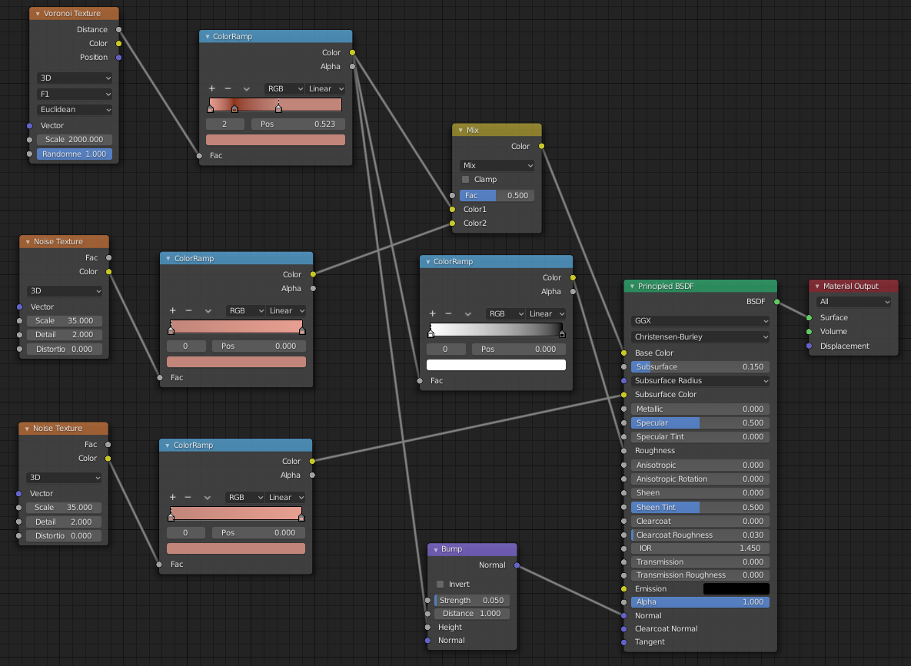

Figure 9 Textures diagram for the skin inside the shader editor in Blender.

A separate discussion must be made for the eyes, by far the most complex surface to simulate. In fact the cornea, iris and pupil were treated as different surfaces. The iris and the pupil, which are respectively the colorful and the black part of the eye, were obtained by separating three concentric circles from the UV sphere of the eyeball and overturning them from convex to concave inside the eye. The pupil was coloured black, while in addition to the chestnut colour, another algorithm was applied to the iris: the gradient texture of the radial type, to create the effect of the lines that depart from the pupil. However, an eye is not only made of colours but also reflections. The cornea was therefore made white on the whole surface, less than near the iris, where it was made transparent. The screen-space reflections and refractions then produced credible reflexes, which significantly contributedto the character's expressiveness.

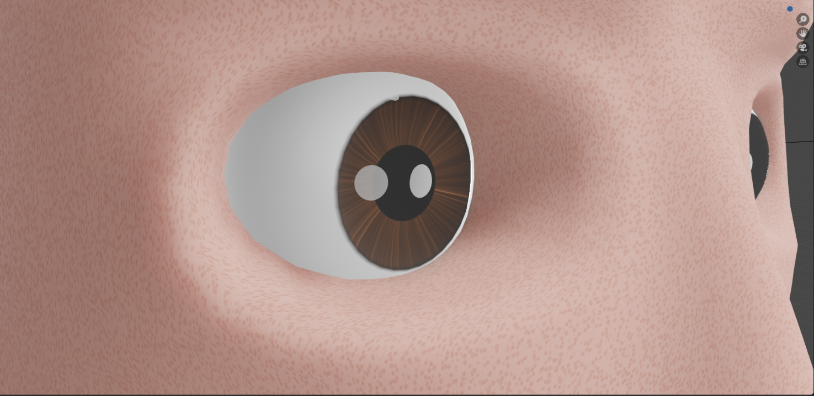

Figure 10 The eyes' textures.

On the other hand, the materials for the jeans, the polo shirt and hair were imported from [textures.com](https://www.textures.com/). The criterion, in this case, was simple and straightforward: apply an albedo, a roughness map and a normal map. Respectively they are a colour map but without additional lights and shadows, an indication of how rough a surface is and an RGB colour map to create a three‑dimensional relief on a two‑dimensional plane.

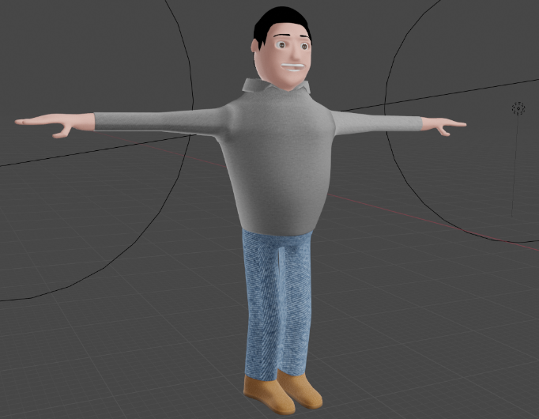

Figure 11 The clothes' textures.

### Modelling the archive

For the character of Maderna, it was necessary to proceed from scratch, because no one had ever modelled him in 3D before. On the contrary, for the realization of the archive, it was possible to reuse numerous models available for free online.

This was the case, for example, of the different bookshelves, which we found at [https://free3d.com/3d-model/bookshelf-539980.html](https://free3d.com/3d-model/bookshelf-539980.html). This model also includes the textures. Then, we took the model and duplicated it eight times, in order to give the idea of an actual archive.

A necessary premise is that no attempt was made to replicate the real Maderna Archive of Bologna, for two reasons: the first is that this pilot was conceived and built in May 2020, in full Coronavirus emergency, and the archive at that time was closed; the second reason is that it is precisely a pilot and attempting to replicate an existing environment in 3D would have been a goal that defied the purpose of this work.

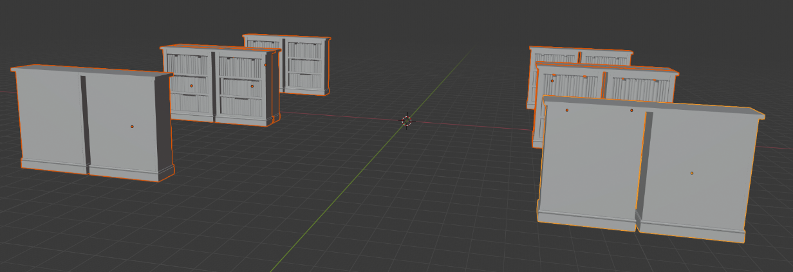

Figure 12 The bookshelves' models.

Returning to the modelling, the scene needed something more; thus, we decided to add some tables. We created just one, and then we duplicated it like we did previously for the bookshelves. Then, we placed the tables between the bookshelves, trying to recreate the way they are commonly placed inside libraries.

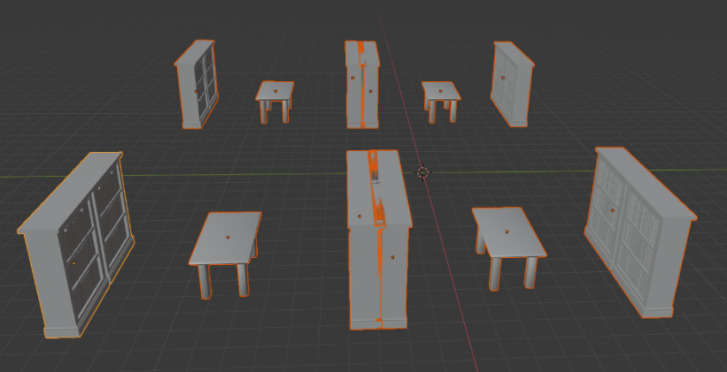

Figure 13 Creation and positioning of the tables between the bookcases.

At this point, our archive needed a floor and a roof. Then, the bookshelves were made to be smaller and copied on top of the libraries that we had placed previously. Afterwards, the balcony was imported and added to give the idea of being inside a fairly old archive.

Figure 14 Models of the walls, the floor and the second bookcases' level.

Next, a globe was put at the centre of the room. In addition, the model for a lamp was imported from this link [https://free3d.com/it/3d-model/avonni-polyresin-table-lamp-214817.html](https://free3d.com/it/3d-model/avonni-polyresin-table-lamp-214817.html), it was duplicated and added on each table. Also,other bookshelves were copied and placed on the wall in the back of the room. Finally, we made a chair with which our character, Bruno, interacts during his monologue.

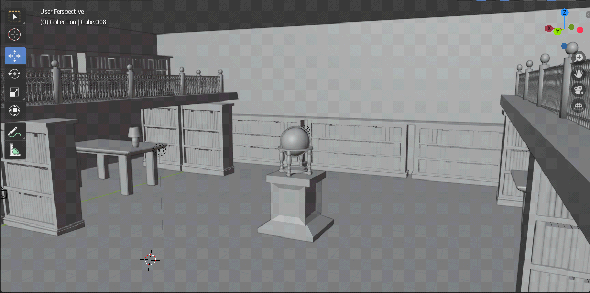

Figure 15 Models of the globe and lamps on the tables.

Now, we can analyze the work we did on the textures. As we did for the character, an albedo, a roughness and a normal map were used for each surface. A parquet was chosen for the floor, made of wood like the cherry wood bookcases. The walls are in rough stucco, while the ceiling is smooth white. As is known, wrought iron goes well with wood, and for this reason, it was used for the railing. To create a pleasant contrast, white polyurethane, that is plastic, was chosen for the tables. The marble pedestal for the globe was designed on the same line. The globe itself, on the other hand, was textured using a single world map, which also extends over the columns and the base, creating the effect of coloured marble. Finally, beige fabric and blue painted ceramic were chosen for the lamps on the tables.

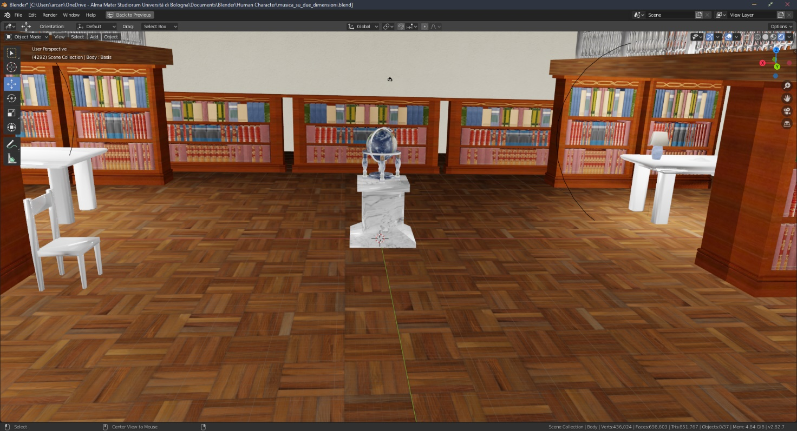

Figure 16 Overview of textures used for the library.

It is interesting to note that even the video reproduced on the screen, which is also imported and not realized from scratch, is itself a texture.

### The animation

The animation we created consists of three types of sequences. Most contain the close-up of Maderna talking, followed by montages of several historical videos and finally a scene in which the character walks. We want to focus on the first and third aspects since the second doesn't concern animation, but it was merely a video montage.

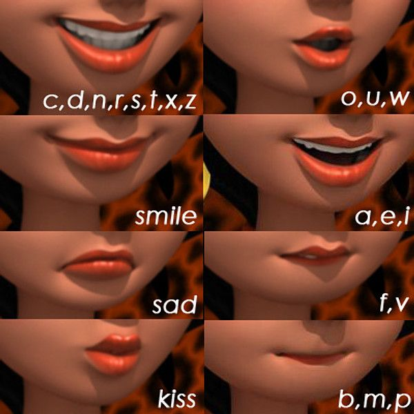

Figure 17 Phonetics articulation of the various alphabet letters.

In order to make the protagonist speak, it was necessary to create libraries for the lips synchronization, that is, a set of poses shapes. The Italian alphabet has twenty-six letters but, in reality, the shapes of the lips are just five (picture 5). This phenomenon is dictated by precise phonological reasons, which concern the articulatory phonetics of the various sounds. For example, /m/, /p/ and /b/ are bilabial, /f/ and /v/ are labio-dental, /n/, /t/, /d/, /s/, /z/ and /r/ are alveolar[\[16\]](#_ftn16). The consequence is that their articulation is extremely similar, and it is possible to group them, simplifying the work.

Once the five shape poses were created, it was necessary to synchronize the movement of the mouth with the audio track. It was done frame by frame, adding the respective keyframes at the most appropriate time. Finally, to make the character look more alive, considerable attention was paid to inserting the so-called fillers, that is the blinking of the eyes, the movement of the eyebrows and the gesticulation.

As for the audio track, it was created through Audacity and slightly modified by lowering its pitch. It is essential to underline that no attempt was made to imitate Maderna's cadence to avoid unsatisfactory or inappropriate results. As will be specified in the chapter on future developments, a good idea would be to hire an actor to dub the character.

The second aspect that we want to touch briefly in this chapter is walking. To achieve it, we chose a formula in five movements: contact, down, passing, up and again contact[\[17\]](#_ftn17). Twelve frames were used for each step, and therefore, the complete cycle lasts for twenty-four frames. In order to complete the entire walk, it was sufficient to multiply this module and add a corresponding translation of the body forward.

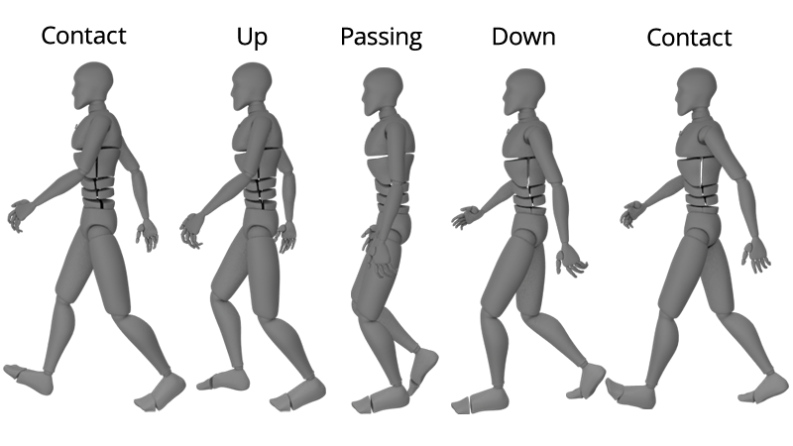

Figure 18 Walk cycle.

To complete the animation, four lights were inserted inside each of the four lamps. Finally, the camera was animated, as if it was a real control room.

Further development and maintenance issues
------------------------------------------

The most natural future development for this project is primarily the realization of everything that was conceived but not produced. To sum up: the modelling of other characters and settings and the implementation of a program to manage the interaction with the end-user. The latter aspect includes the creation of a web app that shows the animation on the client-side, while on the server-side processes the voice commands given by the user during the interaction phase.

In addition to these aspects already widely developed in the chapter on technological development, we want to mention other possible improvements, which particularly take advantage of the 3D cartoon experience developed by Cineca. We refer to a surround sound system, to improve the immersion of the system, and above all, to the recruitment of actors to dub the various characters. It should not be forgotten that one of the main attractions of the Genus Bononiae project was the participation of Lucio Dalla as the voice of Apa.

We now want to discuss the problems related to the preservation of the digital product. We want to focus, in particular, on what has been achieved so far, on how to preserve the animation. Jon Ippolito and Richard Rinehart have thoroughly discussed this topic in the 2014 book_Re-collection: Art, New Media, and Social Memory_. It illustrates how the transition from analogue to digital art made storage, which is the traditional way in which museums preserve cultural heritage, completely ineffective. This happens because keeping, for example, a video not only does not guarantee its longevity but also ensures its obsolescence. This is why a new paradigm is needed, in the book named "variable media", which requires defining a work in a medium-independent way. While the substance and spirit of a digital product can last forever, the hardware and software do not. In this sense, the most valuable version of our animation is the most fruitful, that is, the one that allows recreating the finished product countless times starting from it. Therefore, it is not the rendered video to be essential for the preservation, but the .blend files, that is the information on the polygons, the meshes, the lights, the camera and the keyframes. For this reason, the museum will be sold a license and all the files necessary to render new animations, in addition to the actual animation.

Another central aspect was the choice of modelling software. There are numerous, among the most famous Maya, Cinema 4D, AutoCAD, 3D Studio Max and Unity 3D, some of these superior to Blender for cleaner UI or rendering engine power. However, Blender was chosen precisely for reasons of preservation. Blender is open-source software, and its longevity does not depend on the induced activities of a company, but on the passion of a community. Therefore, it will last longer than all the other software mentioned above. It is also completely free, a non-secondary factor when the recipient is a museum and not a company, a non-profit cultural institution and, therefore, with more limited liquidity.

Roles in the project
--------------------

This project was conceived, created and documented by Gemma Centrone and Arcangelo Massari. Gemma Centrone took care of modelling the library, making researches on it and documenting this process. She also wrote the introduction, the storyline, the screenplay and finally dealt with the museological approach. On the other hand, Arcangelo Massari has dealt with the modelling of the character of Bruno Maderna, with the researches related to his history and in general with the history of music in the twentieth century, in addition to the documentation of this process. He also created the animation and wrote the chapters on technological development, on the description of the interaction between the project and the user, on future developments and maintenance issues.

Finally, we want to underline that this division of roles was not rigid, but fluid and that during the whole process there was a fruitful exchange between the two members of the group.

Bibliography
------------

*   Amellini M., Baroni M., Böhlen M.J., Taccani G.C., Dalmonte R., Garda M., Magnani F., Montecchi G., Noller J., Petazzi P., Riva G., Romito M., Solbiati A., and Vidolin A., (2013). _Studi su Bruno Maderna_, Milano: Edizioni Suvini Zerboni.
*   Articolo 70 – Law 633/1941 on copyright. Retrieved from <[http://www.interlex.it/testi/l41\_633.htm#70](http://www.interlex.it/testi/l41_633.htm#70)\>.
*   Benyon D., (2010). _Designing Interactive Systems_, United States: Addison-Wesley.
*   _Blender 2.82 Reference Manual_. Retrieved from <[https://docs.blender.org/manual/en/latest/](https://docs.blender.org/manual/en/latest/)\>.
*   Booch G., Rumbaugh J., Jacobson I. (2005)_. Unified Modeling Language User Guide, The (2 ed.). p. 496_, London: Pearson.
*   Caraceni, S. (2015). _Designing a taxonomy for virtual museums for the use of AVICOMM professionals_, Plymouth: Plymouth University. Retrieved from <[https://pearl.plymouth.ac.uk/handle/10026.1/9915](https://pearl.plymouth.ac.uk/handle/10026.1/9915)\>.
*   Carrozzino M., Bergamasco M. (2010). _Beyond virtual museums: Experiencing immersive virtual reality in real museums_, Pisa: Scuola Superiore Sant’Anna. Retrieved from: <[http://citeseerx.ist.psu.edu/viewdoc/download?doi=10.1.1.468.9978&rep=rep1&type=pdf](http://citeseerx.ist.psu.edu/viewdoc/download?doi=10.1.1.468.9978&rep=rep1&type=pdf)\>
*   Fubini, E. (2001). _L’estetica musicale dal Settecento a oggi_, Torino: Einaudi.
*   ICOMM Museum Definition. Retrieved from <[https://icom.museum/en/resources/standards-guidelines/museum-definition/](https://icom.museum/en/resources/standards-guidelines/museum-definition/)\>.
*   Ippolito J., Rinehart R. (2014). _Re-collection: Art, New Media, and Social Memory_, Massachusetts: The MIT Press.
*   McCombs, M; Reynolds, A (2002). _News influence on our pictures of the world_. In J. Bryant & D. Zillmann (Eds.), _LEA's communication series. Media effects: Advances in theory and research_ (p. 1–18). Lawrence Erlbaum Associates Publishers.
*   Mottola Molfino A. (2010). _Musei del Genius Loci: il modello italiano_. Italia Nostra, 454. Retrieved from <[http://www.italianostra.org/wp-content/uploads/2010/07/da-Bollettino-IN-del-luglio-2010-n.-454.pdf](http://www.italianostra.org/wp-content/uploads/2010/07/da-Bollettino-IN-del-luglio-2010-n.-454.pdf)\>.
*   (April 4, 2015). _How to Create a Walk Cycle Animation in Blender_. Retrieved from: <[https://www.pluralsight.com/blog/tutorials/walk-cycle-animation-in-blender](https://www.pluralsight.com/blog/tutorials/walk-cycle-animation-in-blender)\>
*   Serianni L., Antonelli G. (2011). _Manuale di linguistica italiana. Storia, attualità, grammatica_, Milano: B. Mondadori.
*   Serrel B. (1994). _The Question of Visitor Styles_, Illinois: Serrel & Associates. Retrieved from < [https://www.informalscience.org/sites/default/files/VSA-a0a4n4-a\_5730.pdf](https://www.informalscience.org/sites/default/files/VSA-a0a4n4-a_5730.pdf) >.
*   _SpeechRecognition 3.8.1_ _Reference Manual_. Retrieved from <[https://pypi.org/project/SpeechRecognition/](https://pypi.org/project/SpeechRecognition/)\>.
*   _Subsurface scattering_. (2020). In _Wikipedia_. Retrieved from <[https://en.wikipedia.org/wiki/Subsurface\_scattering](https://en.wikipedia.org/wiki/Subsurface_scattering)\>.
*   Textures retrieved from <[https://www.textures.com/](https://www.textures.com/)\>.
*   Vaccarone A., Sità M.G., Vitale C. (2014). _Poetiche e culture dall'Ottocento ai giorni nostri_, Bologna: Zanichelli.
*   _Worley noise_. (2020). In _Wikipedia_. Retrieved from < [https://en.wikipedia.org/wiki/Worley\_noise](https://en.wikipedia.org/wiki/Worley_noise)\>.

[\[1\]](#_ftnref1) Benyon D., (2010). _Designing Interactive Systems_, United States: Addison-Wesley.

[\[2\]](#_ftnref2) Amellini M., Baroni M., Böhlen M.J., Taccani G.C., Dalmonte R., Garda M., Magnani F., Montecchi G., Noller J., Petazzi P., Riva G., Romito M., Solbiati A., and Vidolin A., (2013). _Studi su Bruno Maderna_, Milano: Edizioni Suvini Zerboni.

[\[3\]](#_ftnref3) Vaccarone A., Sità M.G., Vitale C. (2014). _Poetiche e culture dall'Ottocento ai giorni nostri_, Bologna: Zanichelli.

[\[4\]](#_ftnref4) Fubini, E. (2001). _L’estetica musicale dal Settecento a oggi_, Torino: Einaudi.

[\[5\]](#_ftnref5) Articolo 70 – Law 633/1941 on copyright. Retrieved from <[http://www.interlex.it/testi/l41\_633.htm#70](http://www.interlex.it/testi/l41_633.htm#70)\>.

[\[6\]](#_ftnref6) Carrozzino M., Bergamasco M. (2010). _Beyond virtual museums: Experiencing immersive virtual reality in real museums_, Pisa: Scuola Superiore Sant’Anna. Retrieved from: <[http://citeseerx.ist.psu.edu/viewdoc/download?doi=10.1.1.468.9978&rep=rep1&type=pdf](http://citeseerx.ist.psu.edu/viewdoc/download?doi=10.1.1.468.9978&rep=rep1&type=pdf)\>

[\[7\]](#_ftnref7) _SpeechRecognition 3.8.1_ _Reference Manual_. Retrieved from <[https://pypi.org/project/SpeechRecognition/](https://pypi.org/project/SpeechRecognition/)\>.

[\[8\]](#_ftnref8) ICOMM Museum Definition. Retrieved from <[https://icom.museum/en/resources/standards-guidelines/museum-definition/](https://icom.museum/en/resources/standards-guidelines/museum-definition/)\>.

[\[9\]](#_ftnref9) Caraceni, S. (2015). _Designing a taxonomy for virtual museums for the use of AVICOMM professionals_, Plymouth: Plymouth University. Retrieved from <[https://pearl.plymouth.ac.uk/handle/10026.1/9915](https://pearl.plymouth.ac.uk/handle/10026.1/9915)\>.

[\[10\]](#_ftnref10) Mottola Molfino A. (2010). Musei del Genius Loci: il modello italiano. Italia Nostra, 454. Retrieved from <[http://www.italianostra.org/wp-content/uploads/2010/07/da-Bollettino-IN-del-luglio-2010-n.-454.pdf](http://www.italianostra.org/wp-content/uploads/2010/07/da-Bollettino-IN-del-luglio-2010-n.-454.pdf)\>.

[\[11\]](#_ftnref11) Serrel B. (1994). _The Question of Visitor Styles_, Illinois: Serrel & Associates. Retrieved from < [https://www.informalscience.org/sites/default/files/VSA-a0a4n4-a\_5730.pdf](https://www.informalscience.org/sites/default/files/VSA-a0a4n4-a_5730.pdf) >.

[\[12\]](#_ftnref12) McCombs, M; Reynolds, A (2002). _News influence on our pictures of the world_. In J. Bryant & D. Zillmann (Eds.), _LEA's communication series. Media effects: Advances in theory and research_ (p. 1–18). Lawrence Erlbaum Associates Publishers.

[\[13\]](#_ftnref13) Booch G., Rumbaugh J., Jacobson I. (2005). _Unified Modeling Language User_ Guide, The (2 ed.). p. 496, London: Pearson.

[\[14\]](#_ftnref14) _Subsurface scattering_. (2020). In _Wikipedia_. Retrieved from <[https://en.wikipedia.org/wiki/Subsurface\_scattering](https://en.wikipedia.org/wiki/Subsurface_scattering)\>.

[\[15\]](#_ftnref15) _Worley noise_. (2020). In _Wikipedia_. Retrieved from <[https://en.wikipedia.org/wiki/Worley\_noise](https://en.wikipedia.org/wiki/Worley_noise)\>.

[\[16\]](#_ftnref16) Serianni L., Antonelli G. (2011). _Manuale di linguistica italiana. Storia, attualità, grammatica_, Milano: B. Mondadori.

[\[17\]](#_ftnref17) Pluralsight. (April 4, 2015). _How to Create a Walk Cycle Animation in Blender_. Retrieved from: <[https://www.pluralsight.com/blog/tutorials/walk-cycle-animation-in-blender](https://www.pluralsight.com/blog/tutorials/walk-cycle-animation-in-blender)\>
